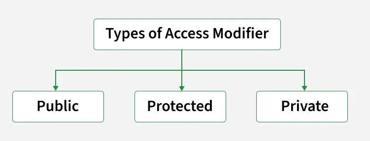

# Encapsulation in Python
- `Encapsulation` is one of the fundamental concepts in object-oriented programming (OOP). It refers to the bundling of `data (attributes) `and` methods (functions)` that operate on that data into a single unit, typically a `class`. 
- It helps in achieving Abstraction. Encapsulation helps to protect the internal state of an object from unintended interference and misuse by restricting access to its internal representation.

# Why do we need Encapsulation?
- Protects data from unauthorized access and accidental modification.
- Controls data updates using getter/setter methods with validation.
- Enhances modularity by hiding internal implementation details.
- Simplifies maintenance through centralized data handling logic.
- Reflects real-world scenarios like restricting direct access to a bank account balance.

# Access Specifiers 
- **They help in implementing encapsulation by controlling the visibility of data**
- In Python, encapsulation is implemented using access modifiers. The most common access modifiers are:
  - `Public`: Attributes and methods are accessible from anywhere.
  - `Protected`: Attributes and methods are accessible within the class and its subclasses (indicated by a single underscore `_`).
  - `Private`: Attributes and methods are accessible only within the class (indicated by a double underscore `__`).

# Declaring Protected and Private Methods
- In Python, you can declare protected and private methods by prefixing the method name with a single underscore `_` for protected methods and a double underscore `__` for private methods. This convention indicates that these methods are intended for internal use within the class or its subclasses.
- Getter and Setter methods are used to access and update the values of private attributes. They provide a controlled way to read and modify the values of private attributes.

# Getter and Setter Methods
- In Python, `getter` and `setter` methods are used to `access` and `modify` private attributes safely. Instead of accessing private data directly, these methods provide controlled access, allowing you to:

    - Read data using a getter method.
    - Update data using a setter method with optional validation or restrictions.