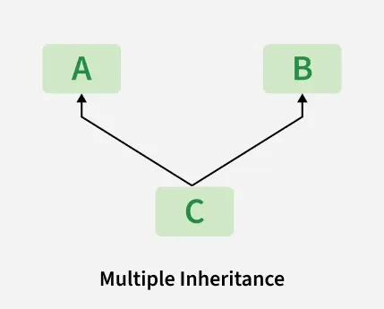
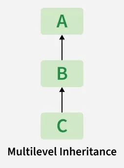
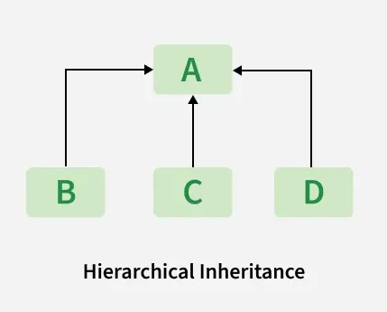

# Inheritance

- `Inheritance` allows a class (child class) to acquire properties/attributes and methods of another class (parent class).

- `Parent class` is the class being inherited from, also called `base class`.

- `Child class` is the class that inherits from another class, also called `derived class`.

# Benefits of Inheritance

- It provides reusability of code by sharing attributes and methods across classes.
- Enables method overriding for customized subclass behavior
- Simplifies maintenance through centralized updates in parent classes.

# super() function
- The `super()` function is used to call a method from the parent class in the child class. It allows access to inherited methods that have been overridden in a class.

- It is commonly used in the child class's `__init__()` method to initialize inherited attributes. This way, the child class can leverage the functionality of the parent class

# types of inheritance in python
- Single Inheritance
- Multiple Inheritance
- Multilevel Inheritance
- Hierarchical Inheritance
- Hybrid Inheritance

    ## multiple inheritance
    When a class can be derived from more than one base class, it is called multiple inheritance. The derived class inherits all the features of the base classes.

    

    ## multilevel inheritance
    When a class is derived from a child class, it is called multilevel inheritance. The derived class inherits all the features of the base class and the child class.

    

    ## hierarchical inheritance
    When more than one `derived  or child class` is created from a `base class`, it is called hierarchical inheritance. The derived classes inherit all the features of the base class.

    

    ## hybrid inheritance
    A classic example of `hybrid inheritance` is the `"Diamond Relationship"`. It combines hierarchical inheritance (one parent, multiple children) and multiple inheritance (multiple parents, one child)

     [ Device ]          <-- Base Class
       /      \
  [ Camera ]  [ Phone ]   <-- Hierarchical Inheritance
       \      /
    [ SmartPhone ]        <-- Multiple & Multilevel Inheritance

    
