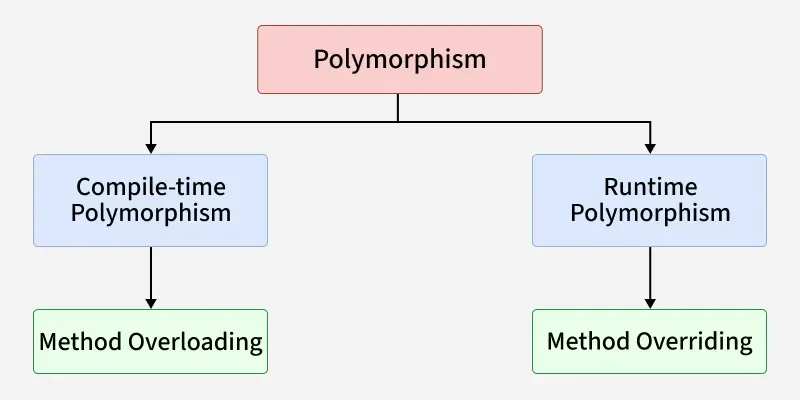

# Polymorphism
- Polymorphism means "many forms" and allows the same `method, function or operator` to behave differently based on the object that it is acting upon.

# types of polymorphism in python
- Compile time polymorphism (method overloading)
- Run time polymorphism (method overriding)

 ## compile time polymorphism

 - Compile time polymorphism is also known as `static polymorphism` or `method overloading`. It allows a class to have multiple methods with the same name but different parameters (number, type, or order of parameters). The method to be executed is determined at compile time based on the arguments passed.
 - Compile-time polymorphism involves selecting a method or operation before program execution, typically through `method or operator overloading`. Languages such as Java and C++ support this feature.
- Python does not support `true compile-time polymorphism` because method calls are resolved at `runtime`. 
- However, similar behavior can be achieved using default arguments, variable-length arguments (*args), or keyword arguments (**kwargs).

## run time polymorphism
- Run time polymorphism is also known as `dynamic polymorphism` or `method overriding`. It allows a subclass to provide a specific implementation of a method that is already defined in its superclass. The method to be executed is determined at runtime based on the object type.